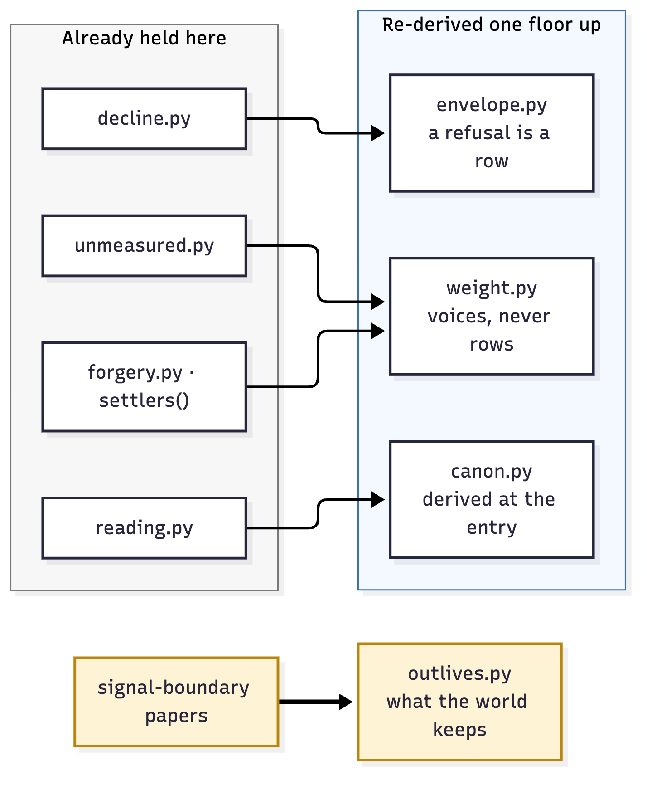

# What the record says

`FINDINGS.md` now carries the result, and the entry is lopsided on purpose.

**Four of the five re-derived rules the bench already held.** A gate must leave
its refusal on the record. A price is paid in voices and never in rows. A
reading is derived at the entry of the thing being judged. Where the record
cannot say how something got in, it charges as though it got in easily.

None of that is a finding. Every one of those rules was already here, paid for
by an attack already recorded, and what the guards show is that the rules
reproduce one floor up — in a transaction lifecycle rather than in a closure —
without being adjusted. That is worth having, and it is a transfer. Writing it
in the other column would be the plainest possible instance of the thing the
file exists to refuse. `axiom_zero.py` keeps REDISCOVERED and BUILT in separate
columns permanently for exactly this reason.

**The fifth question was not derivable from anything here**, and the reason is
the actual finding: the instrument has never released anything into a world.
Its ledger is in memory and nothing it does survives the process that did it,
so the question could not arise from inside because the instrument has no
outside. That is the same shape as the entrance boundary — not derivable from
the governance of the exit, brought in and installed rather than found.

**What the guards do not establish is ARAPAHOE.** Each observation was
translated into this record's idiom and attacked there, which prices the
mechanism and not the blueprint.

## What construction cost

One guard failed on its first run, and the defect was in the test rather than
the mechanism: it asserted a lease as a duration where the code had written it
as a moment. One word wearing two acts, in a file added to a repository whose
first rule is that it must not — caught by running it, which is the only thing
that would have caught it.

One entry also arrived with damage around it. A reflow meant for new prose was
pointed at the whole of `FINDINGS.md` and repacked paragraphs that had been
hand-wrapped, so a change of sixty-three lines presented as two hundred and
twenty-four added and a hundred and fifty-six removed. It was put back in the
next commit rather than amended, and the commit says what happened, because a
tool pointed at more than it was meant to touch is the same error as a guard
that reads more than it was meant to judge.
